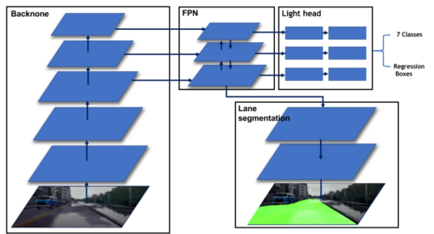

<div align="center"><h1><b> Multi-task Car</h1></b></div>
<h2>Trong mã nguồn này tôi sẽ hướng dẫn huấn luyện và chạy thử  nghiệm mô hình học đa tác vụ cho bài toán xe tự hành gồm các tác vụ như là nhận diện biển báo, phát hiện vật cản và phân đoạn làn đường</h2>

<p align="center"> 

</p>
<p align="center">Kiến trúc của mạng<p align="center">

# Training (PyTorch)
## Bước 1:  Chuẩn bị dataset cho training :
- Tương ứng với mỗi ảnh ta sẽ có 2 dạng dán nhãn là dán nhãn cho phân đoạn ( phần mềm sử dụng là labelme) và dán nhãn cho vật thể ( phần mềm sử dụng là labelimg).
- Thư mục dataset cần chuẩn bị như sau:
    - train (thư mục chứa ảnh train, dán nhãn phân đoạn và vật thể tương ứng)
    - val (thư mục chứa ảnh val, dán nhãn cho phân đoạn và vật thể tương ứng)
## Bước 2: Setup file config [nanodet_custom_xml_dataset.yml](training/config/nanodet_custom_xml_dataset.yml)
- Các thông số cần quan tâm trong config:
    - save_dir(nơi lưu weight sau khi huấn luyện).
    - task (chọn chế  huấn luyện và chạy thử nghiệm, huấn luyện mặc định là multi).
    - num_classes (số  class cần huấn luyện).
    - class_name ( tên các lớp cần huấn luyện)
    - img_path, ann_path, seg_path (đường dẫn đến thư mục train và val tương ứng).
    - input_size (kích thước ảnh đầu vào).
    - gpu_ids (chọn GPU để huấn luyện).
    - batchsize_per_gpu (chọn số lượng batch cần huyến luyện)
    - val_intervals (Chọn epoch để chạy val)
## Bước 3: Tiến hành training bằng lệnh sau:
- ```python train.py --summary True config/nanodet_custom_xml_dataset.yml```
# Inference (PyTorch)
Lúc huấn luyện ta cần huyến luyện đa tác vụ để các task có thể  chia sẽ thông tin cho nhau, còn lúc chạy thực nghiệm ta có thể chọn nhiệm vụ để chạy tùy theo mục đích. Để lựa chọn tác vụ ta chỉnh lại task trong file config [nanodet_custom_xml_dataset.yml](inference/config/nanodet_custom_xml_dataset.yml)
- Chạy thực nghiệm trên ảnh 
```bash
python demo/demo.py image --config CONFIG_PATH --model MODEL_PATH --path IMAGE_PATH
```
- Chạy thực nghiệm trên video
```bash
python demo/demo.py video --config CONFIG_PATH --model MODEL_PATH --path VIDEO_PATH
```
# Chứng minh hiệu quả của học đa tác vụ
Network                 | Recall           |mAP|IoU| Pre-train weight |
:--------------------:|:------------------:|:--------:|:------:|:-----:|
Detection(only)        | 85.9%  | 89.3%  |  -  |  117.35fps | 
Segmentation(only       | -  | -  |  94.9%  | 133.33fps | 
Detection+Segmentation    |85.9%  | 89.3%  |  94.9%  | 60.22fps |
Multi-task        | 86.3%  | 89.4%  |  95.9%  |  100.56fps |
- Từ bảng cho thấy việc học đa tác vụ giúp cho Recall, mAP và IoU đều tăng lên so với việc huấn luyện từng tác vụ ngoài ra tốc độ nhanh hơn vượt trội so với việc chạy tuần tự từng nhiệm vụ.